## 一、统一星型模型简介

### 1.1 简单介绍
统一星型模型是一个以“bridge表”为中心的星型模型。
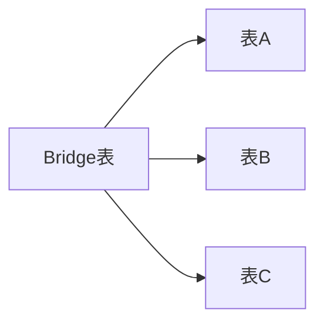

### 1.2 应用的地方
统一星型模型是一个数据集市，**位于数据仓库的展现层**。统一星型模型完全基于数据结构，并不依赖业务需求。业务需求被推到数仓库之外，它们由BI工具来实现，因为那里才是解决业务需求的地方。

![[Pasted image 20230814140740.png]]
### 1.3 与传统维度建模的区别

| 区别         | 传统维度建模                                             | 统一星型模型                     |
| ------------ | -------------------------------------------------------- | -------------------------------- |
| 星型模型个数 | 以单个事实表为中心。如果有6个事实表，至少需要创建6个星型模型 | 通过bridge表，只需要一个星型模型 |
| 重点区分     | 事实表和维表                                             | 表中是否有度量                   |
| 关注点       | 业务需求                                                 | 基于数据结构，不依赖业务需求                                 |
### 1.4 具体的例子
使用销售表Sales和产品表Products来说明统一星型模型怎么构建。
#### 1.4.1 原表数据

Products表数据如下：

| ProductID | ProductName     | UnitPrice |
| --------- | --------------- | --------- |
| PR01      | Hard Disk Drive | 100       |
| PR02      | Keyboard        | 70        |
| PR03      | Tablet          | 300       |
| PR04      | Laptop          | 400       |

Sales表数据如下：

| SalesID | Date     | Client    | Product | Quantity | Amount |
| ------- | -------- | --------- | ------- | -------- | ------ |
| 1       | 2023/1/1 | Bill      | PR01    | 1        | 100    |
| 2       | 2023/1/2 | Bill      | PR02    | 1        | 70     |
| 3       | 2023/1/2 | Francesco | PR02    | 2        | 140    |
| 4       | 2023/1/3 | Francesco | PR03    | 1        | 300    |

#### 1.4.2 统一星型模型方式


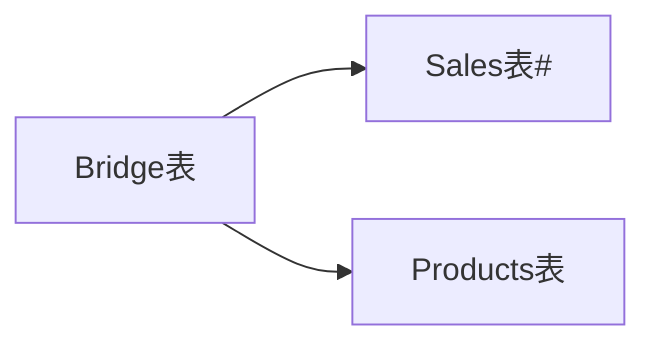

箭头指向表示Bridge表有外键指向Sales表，外键在左边，主键在右边。#表示表中至少包含一个度量。
#### 1.4.3 统一星型模型中的表

使用星型模型，几乎所有的表与原表相同，但是它们必定有一个名为“KEY_TableName”的附加列。这一列必须是表的主键，建议放在第一列。

虽然KEY_Products和ProductID列是相同的，这并不多余，第一列是“技术列”，用于连接；第二列是“业务列”，可以展示在最终报表和仪表盘中。

统一星型模型中Products表数据如下（新增一列KEY_Products）：

| KEY_Products | ProductID | ProductName     | UnitPrice |
| ------------- | --------- | --------------- | --------- |
| PR01          | PR01      | Hard Disk Drive | 100       |
| PR02          | PR02      | Keyboard        | 70        |
| PR03          | PR03      | Tablet          | 300       |
| PR04          | PR04      | Laptop          | 400       |


统一星型模型中Sales表数据如下（新增一列KEY_Sales）：
   
| KEY_Sales | SalesID | Date     | Client    | Product | Quantity | Amount |
| --------- | ------- | -------- | --------- | ------- | -------- | ------ |
| 1         | 1       | 2023/1/1 | Bill      | PR01    | 1        | 100    |
| 2         | 2       | 2023/1/2 | Bill      | PR02    | 1        | 70     |
| 3         | 3       | 2023/1/2 | Francesco | PR02    | 2        | 140    |
| 4         | 4       | 2023/1/3 | Francesco | PR03    | 1        | 300    |


Bridge表实际上是由多个stage合并成的一个外键矩阵，其中，每一个stage的记录行数与其来源表相同。
  
| Stage    | KEY_Sales | KEY_Products |
| -------- | --------- | ------------ |
| Sales    | 1         | PR01         |
| Sales    | 2         | PR02         |
| Sales    | 3         | PR02         |
| Sales    | 4         | PR03         |
| Products | NULL      | PR01         |
| Products | NULL      | PR02         |
| Products | NULL      | PR03         |
| Products | NULL      | PR04         |

#### 1.4.4 统一星型模型连接

![[Drawing 2023-08-14 15.14.49.excalidraw]]

```sql
select *
from Bridge t1
left join Sales t2
on t1.KEY_Sales = t2.KEY_Sales
left join Products t3
on t1.KEY_Products = t3.KEY_Products
```

连接的结果如下：
![[Pasted image 20230814153449.png]]
## 二、数据集市的演变

### 2.1 操作系统与数据仓库的区别

| 数据仓库         | 数据集市           |
| ---------------- | ------------------ |
| 企业范围         | 部门或者小型组织   |
| 需要集成         | 轻量集成或者无集成 |
| 快照数据         | 快照数据           |
| 深层次的历史数据 | 浅层次的历史数据   |

### 2.2 数据集市的发展历程

数据仓库的实施需要整个企业范围内的参与，许多组织没有意愿也没有愿景来进行长期数据仓库的开发。解决问题的一个妥协的办法是构建数据集市。数据集市在很多方面跟数据仓库非常类似，但是最大的不同是，与数据仓库相比，数据集市需要的工作范围要小得多。由于规模小，因此可以更快地构建数据集市。

第一个数据集市总是最令人兴奋的。数据集市的构建便宜又迅速。一但建成，数据集市就成为数据分析处理的良好基础。

由于数据集市的成功传播，很快，企业内的其他部门决定也搭建自己的数据集市。很快就出现一些新的数据集市。

随着时间的推移，数据集市变得一团糟。数据集市造成的数据完整性问题随时可见。（完整性是指数据准确性并且可靠性）。
![[Pasted image 20230814192452.png]]
幸运的是，还有另一种解决方案。这个替代方案可以被成为“集成数据集市”。
主要区别是，在集成数据集市方法中，数据集市的数据源是一个数据仓库。

![[Pasted image 20230814192531.png]]

## 三、统一模型解决的问题

### 3.1 数据丢失

数据丢失的定义：基于一组原始表（A，B）,生成一个新表T。当新表T的信息少于原始表时，这个转换就造成了数据丢失。

join容易造成数据丢失。因为统一星型模型的bridge表是union all生成的，所以不存在数据丢失问题。

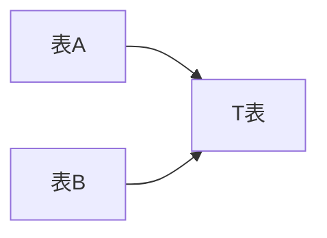


### 3.2 扇形陷阱
扇形陷阱的定义：B表的每行记录至少包含一个度量，被A炸开（**表A和表B是多对一的关系**）。


![[Drawing 2023-08-15 09.20.18.excalidraw]]

在日常生活里，当下了一笔大单时，可能供应商并没有足够的库存。想象一下这样的场景，一个客户需要购买40块硬盘，但是商店里只有10块，第一个发货立即进行，将10块现有硬盘立即发出，剩下的30块硬盘则立即尽快发货。

如上场景可知，发货单表Shipments和销售表Sales的关系是Sales表的一行数据可能会对应的Shipments表的多行。两表关联时，Sales表的度量如销售额和销售数量会被炸开。

统一星型模型的bridge表跟Sales表和Shipments表关联不会把数据炸开，所以不存在扇形陷阱。

某些BI工具，如power Bi和Tableau 有内存关联（非连接）功能，用传统维度建模也可以避免扇形陷阱。
### 3.3 Chasm陷阱（笛卡尔积）

Chasm陷阱的定义：两种分解互相“冲突”。表X并不是唯一被分解的表，实际上A被B分解，B被A分解。

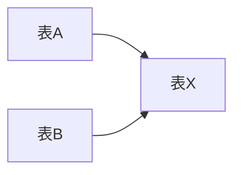

如学生技能表，一个学生可能拥有多项技能；学生语言表，一个学生可能会多种语言。两个表的关系是多对多，关联的话就会发生Chasm陷阱。

统一星型模型的bridge表的设计不会发生Chasm陷阱。
### 3.4 多事实查询
销售表Sales和采购表Purchases是没有直接联系的两个事实表，因为没有任何指向主键的外键。两个表至少具有一个共同的维度产品，日期也是一个维度。如果想针对这些共同维度进行横向分析，传统的连接方法针对每个业务需求都需要一个不同的查询，但是统一星型模型不需要，因为bridge表本身就是一个联合了。

### 3.5 循环

循环的定义：一个实体到另外一个实体间，可以找到多条路径。如实体A到实体B，既可以直接连接，也可以通过实体C形成连接，这就是一个循环。

如果要避免循环，n张表最多使用n-1条连接。

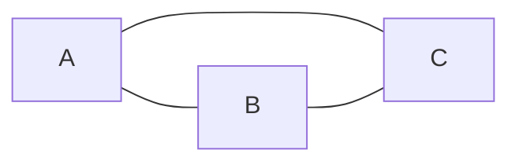


来看一个包含3个事实表（即邮件表Email、电挂沟通表PhoneCalls和交易表Deals）的例子。每个表都可以指向客户表Customers和Employees两个维表。如图所示。

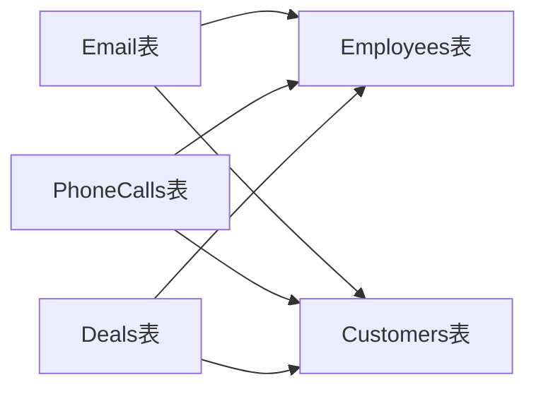

5个表有6条连接，构成循环，怎么解决循环呢？

**方法一：用联合（union）来处理**
将三张事实表用过union联合在一起，就可以解决循环。但是联合存在两个缺点：第一，它不是用户好友的；第二，通过联合得到的表只是将数据混合在一起，并不能代表一个特定的业务实体。
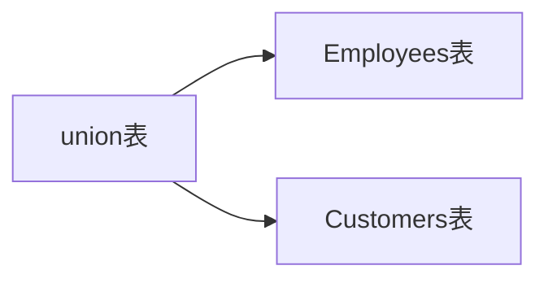
**方法二：使用统一星型模型**

6个表使用5条连接，没有循环。

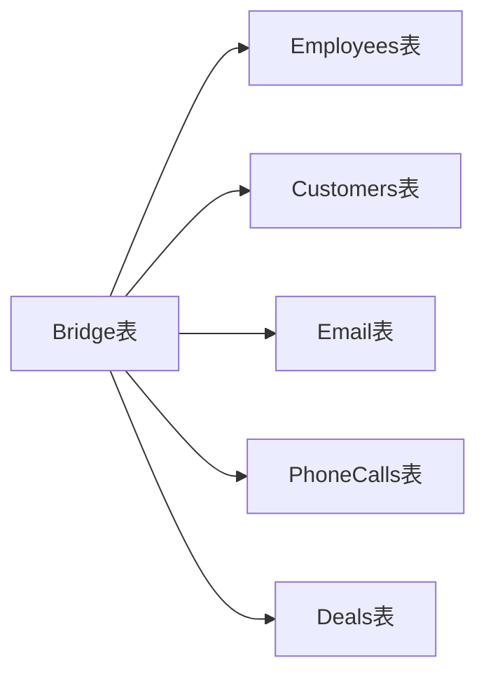
### 3.6 非一致粒度

销售表Sales和目标表Targets在本质上粒度是不一致的。

许多组织为了营销设定目标，但是目标绝没有销售那么详细。通过情况下，不会为每个客户设定目标，而是为了一组客户（如国家）设定目标。同样的，也不会为每个产品设定目标，而是为一组产品（如产品线）设定目标。

有经验的开发人员通常将Sales表汇总到Targets表的粒度来解决这个问题。虽然这个方案有效，但是有一个缺点：当想下钻到Sales表的详细信息时，必须创建一个新的单独的查询，而且这两个查询不会联动。

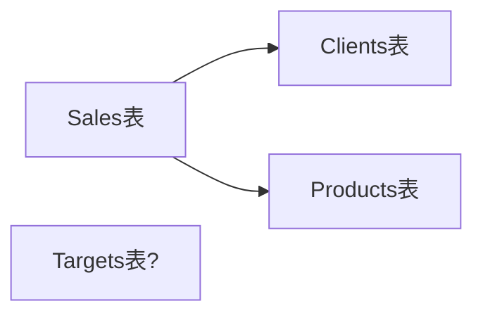


重新范式化后如下图。
但是6个表有7条连接，产生循环，可以用统一星型模型解决。

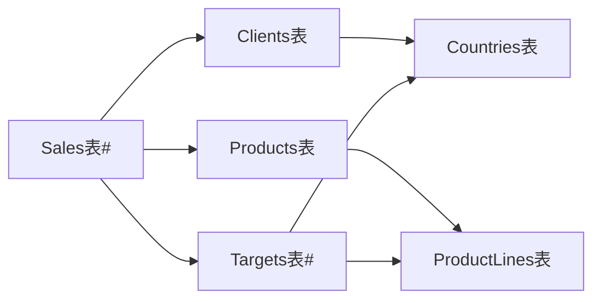


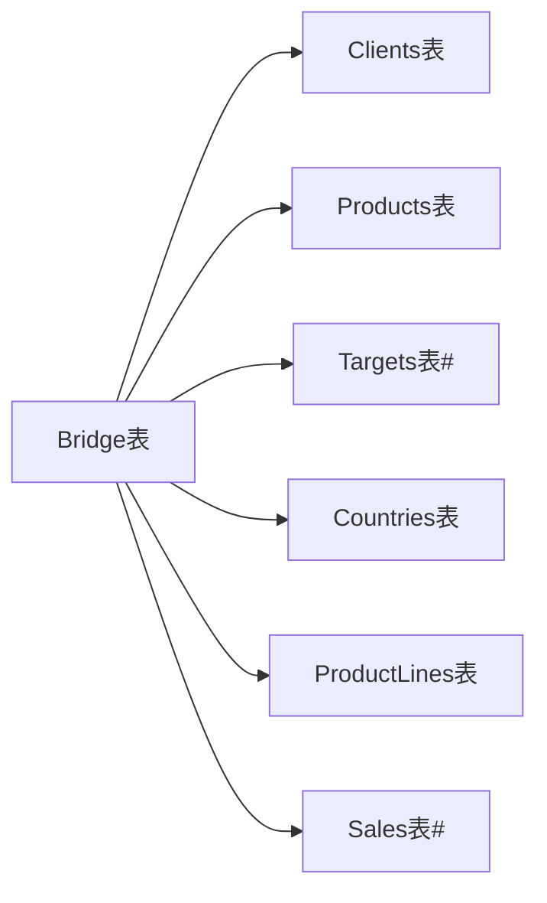
