[TOC]


## 1. markdown基础

### 1.1 标题

最多6级标题，快捷键：

一级标题：ctrl+1

二级标题：ctrl+2

...


### 1.2 文字

#### 1.2.1 加粗、高亮

- 加粗快捷键：ctrl+b

**加粗字体**

- 高亮：需要加亮字体的前后加上两个等于号=

==需要高亮的字体==


#### 1.2.2 更换颜色

```html
<font color="red">我是红色字体</font>
```

<font color="red">我是红色字体</font>

常见的颜色：

红色：red	黄色：yellow	蓝色：blue	黑色：black	橙色：orange

#### 1.2.3 斜体、删除线、下划线

- 斜体快捷键：ctrl+i

*我是斜体*

- 删除线快捷键：alt+shift+5 或者删除文字前后加两个~

~~我是删除线~~

- 下划线快捷键：ctrl+u

<u>我是下划线</u>


#### 1.2.4 上下标

- 上标：需要上标文字前后加^

m^2^

- 下标：需要下标文字前后加~

H~2~O


### 1.3 超链接与图片

- 链接的快捷键：ctrl+k

  - 外部链接:`[link text](link)`

    [百度](www.baidu.com)

  - 内部链接:`[link text](#要去的目的地--标题）`

    [回到三级标题-文字](#1.2 文字)

    

- 图片的快捷键：Ctrl+Shift+i


### 1.4 列表

- 无序列表快捷键：符号（-或+或*）+空格

- 有序列表的快捷键：数字+点+空格
- 增加缩进：tab或Ctrl+]
- 减少缩进：Ctrl+[

### 1.5 代码块

代码块的快捷键：三个~+语言类型，如````java`

```java
public class MyConstant {
    public static void main(String[] args) {
        // 字符串常量（快捷键sout）
        System.out.println("hello world!");
    }
}
```

### 1.6 表格

表格的快捷键：ctrl+t

| name | age  |
| :--: | :--: |
| wfm  |  18  |


### 1.7 目录

插入目录的快捷键： [TOC]

### 1.5 其他

- 分割线的快捷键：三个-

  ---

- 引用的快捷键：>

> 我没有说过这句话--鲁迅

- 脚注：`[^内容]:`

  > 我没有说过这句话--鲁迅[^1]

  [^1]:出自xxx

  

  跳转到注释[^jump]。

  [^jump]:这是注释


## 2. markdown绘图

### 2.1 流程图

```markdown
flowchart 方向描述
	图表中的其他语句...
```

其中方向描述为 TB：从上到下	BT：从下到上	RL:从右到左	LR:从左到右

最常用的布局是TB、LR。

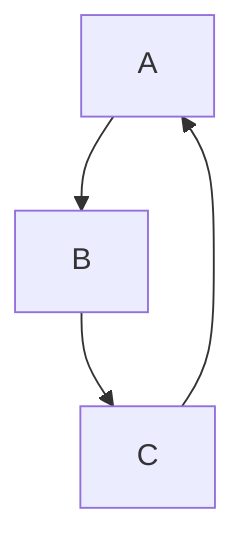


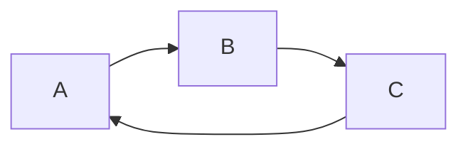

#### 2.1.1 节点形状


| 表述       | 说明           | 含义                                           |
| ---------- | -------------- | ---------------------------------------------- |
| id[文字]   | 矩阵节点       | 表示过程，也就是整个流程中一个环节             |
| id(文字)   | 圆角矩形节点   | 表示开始和结束                                 |
| id((文字)) | 圆形节点       | 表示连接。为避免流程过长或有交叉，可将流程切开 |
| id{文字}   | 菱形节点       | 表示判断、决策                                 |
| id>文字]   | 向右旗帜状节点 |                                                |

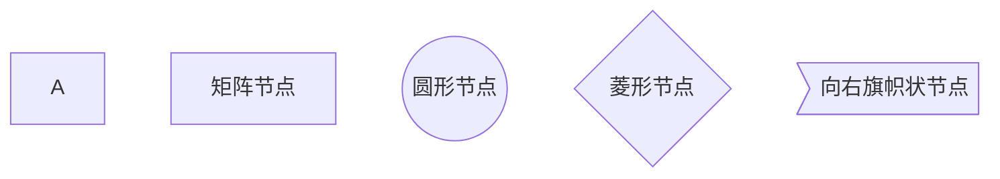

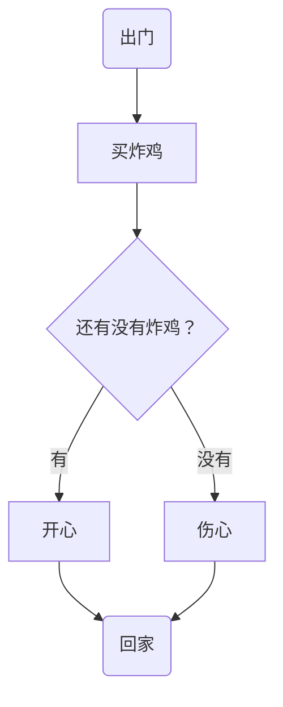


#### 2.1.2 连线

```mermaid
flowchart TB
	A1---B1
	A2-->B2
	A3--TEST---B3
	A4--TEST-->B4
	C1.-D1
	C2.->D2
	C3-.TEST.-D3
	C4-.TEST.->D4
	E1===F1
	E2==>F2
```


#### 2.1.3 子图表

```markdown
subgraph 子图表名称
	子图表中的描述语句...
end
```

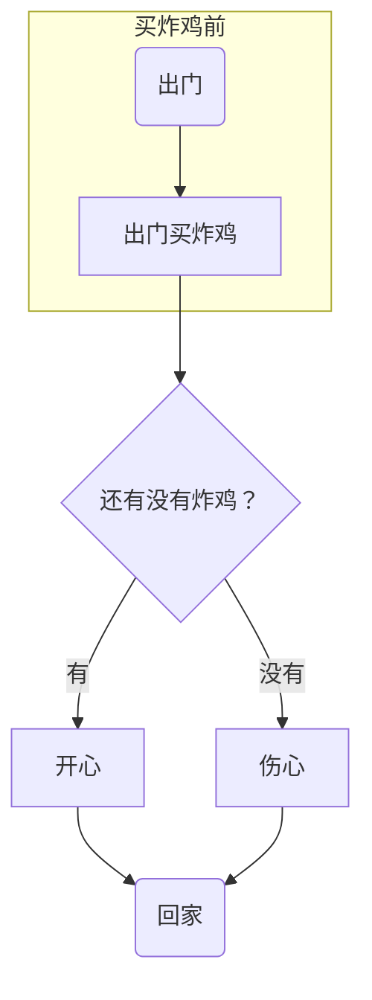


### 2.2 时序图

```markdown
sequenceDiagram
	[参与者1][消息线][参与者2]；消息体
	...
```

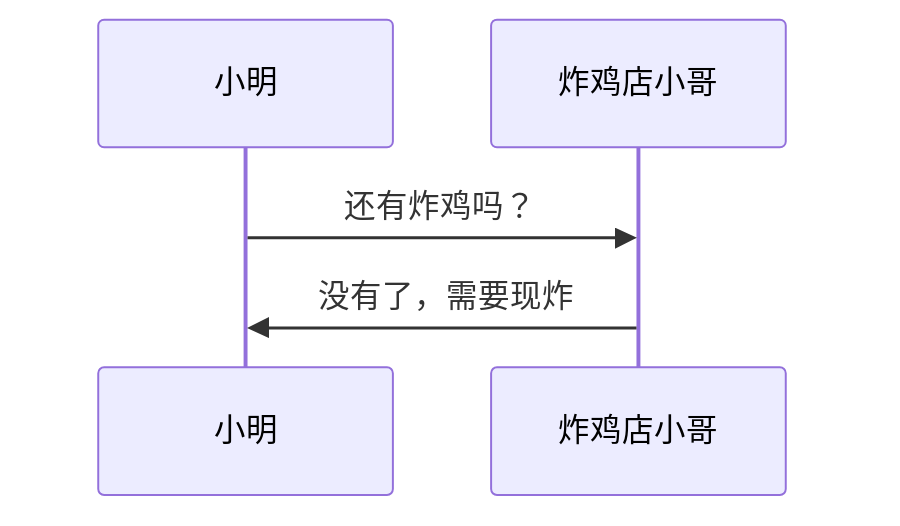

#### 2.2.1 参与者（participant）

```markdown
sequenceDiagram
	participant 简称1 as 参与者1 
	...
	participant 简称n as 参与者n
	
```

#### 2.2.2 消息线

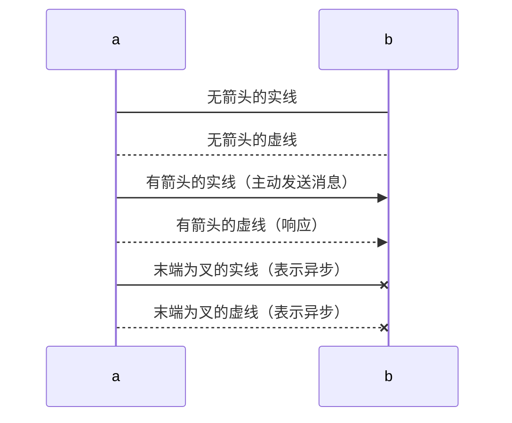


####  2.2.3 处理中-激活框

在消息线末尾添加`+`,则消息接收者进入当前消息的“处理中”状态；

在消息线末尾添加`-`,则消息接收者离开当前消息的“处理中”状态；

```mermaid
sequenceDiagram
	participant 11 as 小明
	participant 22 as 炸鸡店小哥
	11 ->>22:还有炸鸡吗?
	22 -->>11:没有了，要现炸。
	11 -x+22:麻烦给我炸！
	22 -->>-11:你的炸鸡好了！
	
```


#### 2.2.4 注解（note）

```markdown
note 位置表述 参与者:标注文字
```

位置表述：

右侧：right of 	左侧：left of	横跨多个参与者：over

```mermaid
sequenceDiagram
	participant 11 as 小明
	participant 22 as 炸鸡店小哥
	note over 11,22:热爱炸鸡
	note left of 11:女
	note right of 22:男
	11 ->>22:还有炸鸡吗?
	22 -->>11:没有了，要现炸。
	11 -x+22:麻烦给我炸！
	22 -->>-11:你的炸鸡好了！
```


#### 2.2.5 循环（loop）

```mermaid
sequenceDiagram
	participant 11 as 小明
	participant 22 as 炸鸡店小哥
	11 ->>22:还有炸鸡吗?
	22 -->>11:没有了，要现炸。
	11 -x+22:麻烦给我炸！
		loop 三分钟一次
		11->>22:我的炸鸡好了吗
		22-->>11:正在炸
	end
	22 -->>-11:你的炸鸡好了！
```


#### 2.2.6 选择（alt）

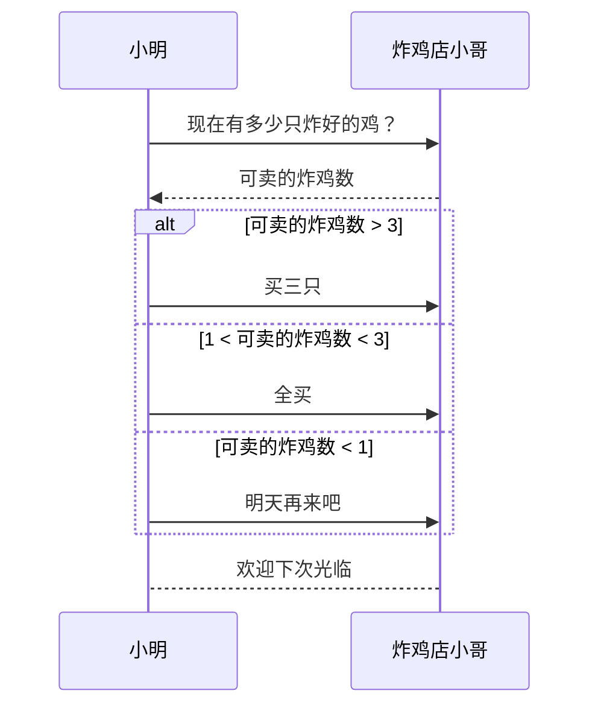


#### 2.2.7 可选（opt）

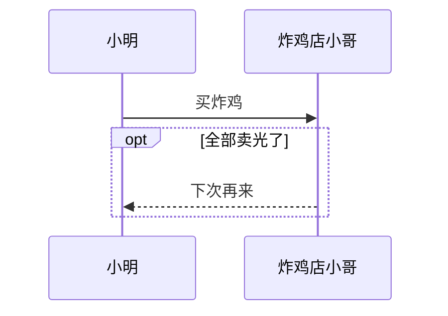


#### 2.2.8 并行（par）

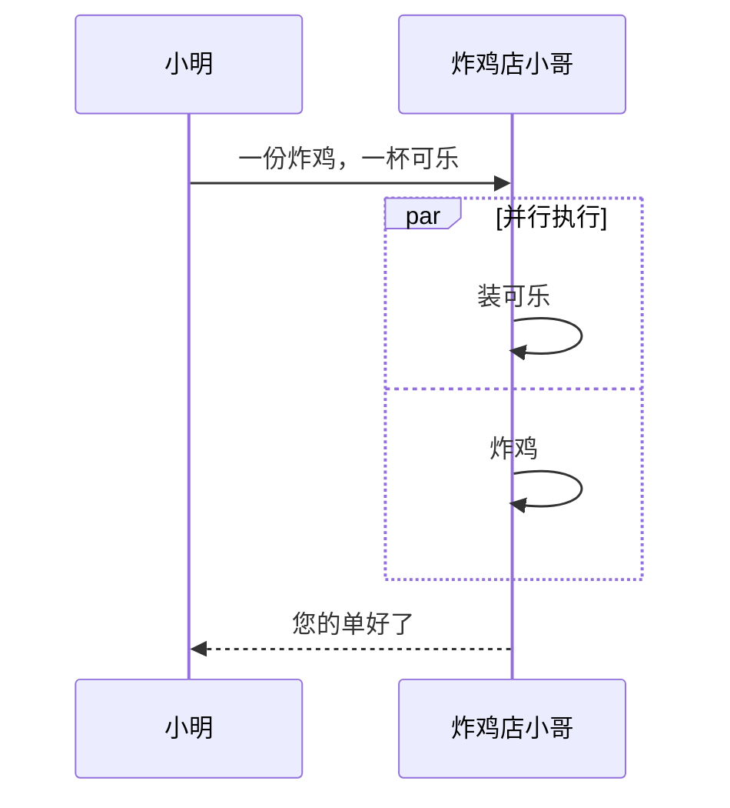


### 2.3 饼图

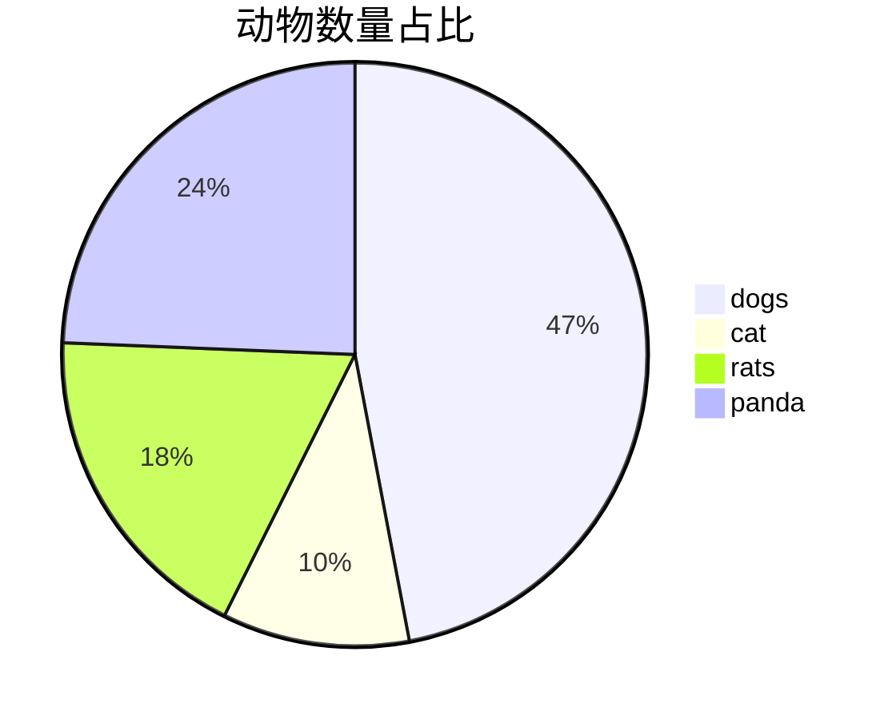


### 2.4 其他

[mermaid官网](https://mermaid.js.org/syntax/sequenceDiagram.html)


